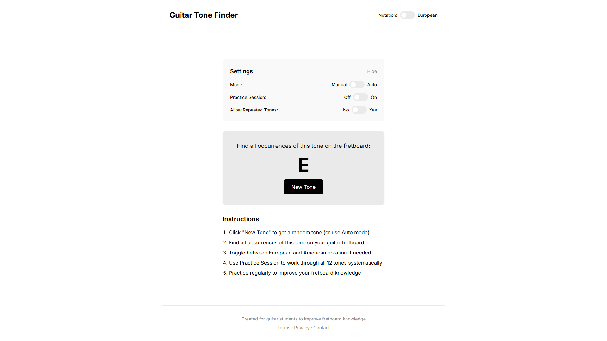

# Guitar Tone Finder

A clean, minimalist web application designed to help guitar students practice identifying tones on the fretboard. Built with HTML, CSS, and vanilla JavaScript.



## Features

- **Random Tone Generator**: Displays random tones for students to find on their guitar fretboard
- **European/American Notation**: Toggle between European notation (with B/H) and American notation (with Bb/B)
- **Automated Mode**: Option to automatically change tones at adjustable time intervals
- **Practice Session**: Structured practice mode that cycles through all 12 tones exactly once
- **No-Repeat Option**: Prevent the same tone from appearing twice in a row
- **Responsive Design**: Works on desktop, tablet, and mobile devices
- **Clean UI**: Vercel-inspired minimalist black and white design

## Demo

Try the live demo: [Guitar Tone Finder](https://pilot2254.github.io/guitar-tone-finder)

## Installation

No installation required! This is a client-side application that runs entirely in the browser.

1. Clone the repository:
```
git clone https://github.com/pilot2254/guitar-tone-finder.git
```

2. Open `index.html` in your web browser.

That's it! No build process, no dependencies to install.

## Usage

### Basic Usage

1. Open the application in your web browser
2. Click the "New Tone" button to get a random tone
3. Find all occurrences of this tone on your guitar fretboard
4. Click "New Tone" again for a new challenge

### Settings

- **Notation**: Toggle between European (B/H) and American (Bb/B) notation systems
- **Mode**: Choose between Manual (click for new tone) or Auto (tones change automatically)
- **Auto Interval**: When in Auto mode, adjust how many seconds between tone changes (3-15s)
- **Practice Session**: Enable to work through all 12 tones systematically
- **Allow Repeated Tones**: Choose whether the same tone can appear twice in a row

## How It Works

The application uses vanilla JavaScript to:

1. Generate random tones from the 12-tone chromatic scale
2. Handle the differences between European and American notation systems
3. Manage practice sessions with progress tracking
4. Implement automated tone changes with a customizable timer

The UI is built with HTML and styled with Tailwind CSS (via CDN) for a clean, responsive design.

## Notation Systems Explained

This tool handles the difference between European and American notation systems for guitar:

- **European Notation**: Uses 'H' for the tone between A and C, and 'B' for what Americans call 'Bb'
- **American Notation**: Uses 'B' for the tone between A and C, and 'Bb' for what Europeans call 'B'

All other tones (C, C#, D, D#, E, F, F#, G, G#, A) are the same in both systems.

## Browser Compatibility

The Guitar Tone Finder works in all modern browsers:

- Chrome (recommended)
- Firefox
- Safari
- Edge

## Customization

You can easily customize this tool:

- Modify `styles.css` to change the appearance
- Edit the tone arrays in `script.js` to work with different notation systems
- Adjust the timer ranges in the HTML and JavaScript

## Future Enhancements

Potential future improvements:

- Interactive fretboard visualization
- Audio playback of tones
- Difficulty levels
- Progress tracking and statistics
- Dark mode
- Offline support

## Contributing

Contributions are welcome! Please feel free to submit a Pull Request.

## License

This project is licensed under the MIT License - see the LICENSE file for details.

## Acknowledgments

- Inspired by the clean design aesthetic of [Vercel](https://vercel.com)
- Built with [Tailwind CSS](https://tailwindcss.com)
- Uses [Inter font](https://fonts.google.com/specimen/Inter) from Google Fonts
